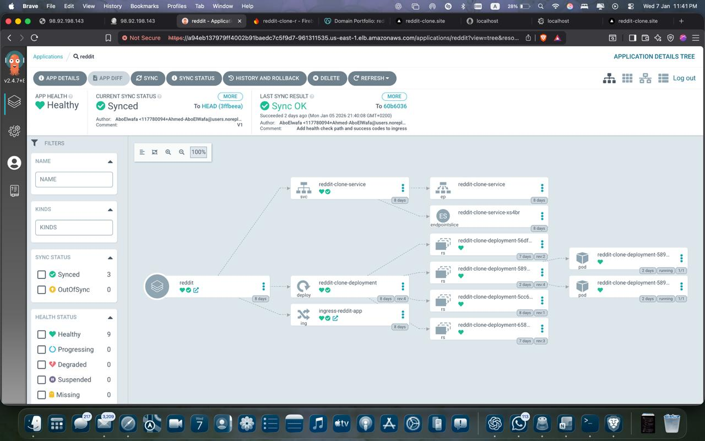

# 🚀 Reddit Clone – DevSecOps Platform on **AWS EKS | Jenkins CI | ArgoCD GitOps | Security Scanning | Observability**

An end-to-end **DevSecOps platform** that demonstrates how to build, secure, deploy, and observe a cloud-native application using **CI/CD, GitOps, Kubernetes, and AWS**.  
This project was built collaboratively and focuses on **production-style architecture and best practices**.

---

## 🧠 Project Overview

This platform automates the full lifecycle of a Reddit Clone application:

- Infrastructure provisioning using **Terraform**
- Secure **CI pipeline** with Jenkins and multiple security gates
- **GitOps-based CD** using ArgoCD
- Deployment on **AWS EKS**
- **Monitoring & observability** with Prometheus and Grafana

Git is used as the **single source of truth**, ensuring consistency, traceability, and automated recovery.

---

## 🏗️ Architecture Diagram

**Flow Summary:**

1. Developer commits code to GitHub  
2. Jenkins CI pipeline is triggered  
3. Build, test, and security scans are executed  
4. Docker image is built and pushed  
5. Kubernetes manifests are updated in Git  
6. ArgoCD syncs changes to AWS EKS  
7. Application is monitored via Prometheus & Grafana  

---

## 🛠️ Tech Stack

### ☁️ Cloud & Infrastructure
- **AWS** (EKS, VPC, IAM, ACM, Route 53)
- **Terraform** (Infrastructure as Code)

### 🔁 CI / CD
- **Jenkins** – CI pipeline orchestration
- **ArgoCD** – GitOps continuous delivery
- **GitHub** – Source control & GitOps repo

### 🔐 Security & Quality
- **SonarQube** – Static code analysis + Quality Gates
- **OWASP Dependency-Check** – Dependency vulnerability scanning
- **Trivy** – Filesystem & container image scanning

### 🐳 Containerization & Orchestration
- **Docker** – Image build & push
- **Kubernetes (EKS)** – Application orchestration

### 📊 Observability
- **Prometheus** – Metrics collection
- **Grafana** – Visualization & dashboards
- **AWS Secrets Manager** – Secure credential management

---

## 🔐 CI Pipeline – Jenkins

The Jenkins pipeline enforces **security-first CI** with multiple quality gates:

**Pipeline Stages:**

1. Application build (`npm build`)
2. SonarQube analysis + Quality Gate
3. OWASP Dependency-Check
4. Trivy filesystem scan
5. Docker image build
6. Trivy image scan
7. Push image to DockerHub
8. Update Kubernetes manifests in GitHub

> 🚫 The pipeline **fails automatically** if any security or quality check does not pass.

---

## 🔁 GitOps CD – ArgoCD

ArgoCD continuously watches the Git repository and reconciles the desired state.

### 📦 Application Resource Tree

### 🌐 Network View

**Enabled GitOps Features:**
- Auto-sync
- Self-heal
- Pruning

This guarantees the cluster always matches Git.

---

## ☸️ Kubernetes Best Practices

- Replica-based deployments for high availability
- Readiness, liveness & startup probes
- Resource requests & limits
- ALB Ingress Controller for external access
- HTTPS using AWS ACM

---

## 📊 Monitoring & Observability

### 🔎 Prometheus Targets

### 📈 Grafana Dashboards

**Monitoring Coverage:**
- Kubernetes cluster metrics
- Application workloads
- Node & resource utilization
- Jenkins metrics

---

## 🖥️ Application UI

The Reddit Clone application deployed successfully on AWS EKS:

---

## 🎯 Key Learnings

- Implementing **shift-left security** in CI pipelines
- Applying **GitOps principles** in real-world deployments
- Designing resilient Kubernetes workloads
- Treating observability as a **core platform component**
- Understanding DevSecOps as a **system**, not isolated tools

---

⭐ If you find this project useful, consider starring the repository!
